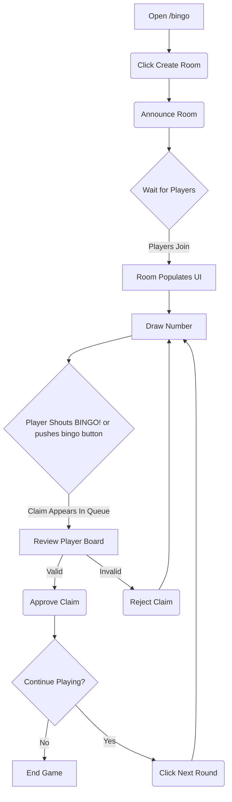
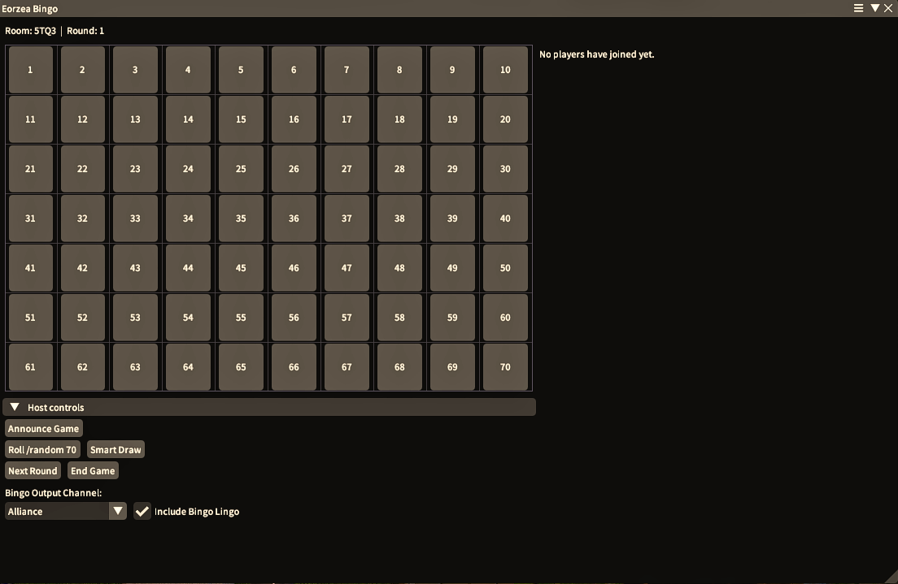
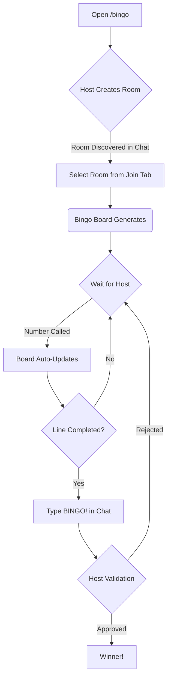
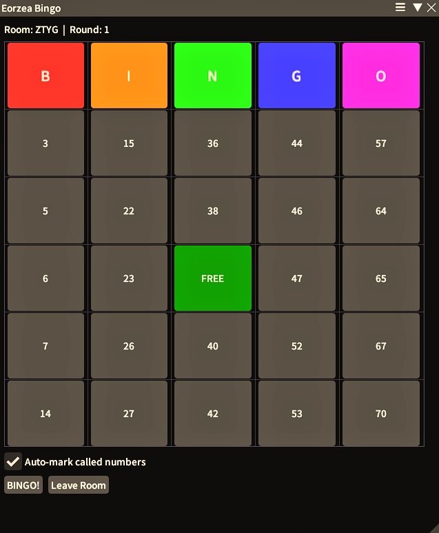

# Eorzea Bingo

Eorzea Bingo is a fully featured, chat driven multiplayer Bingo game plugin for Final Fantasy XIV, powered by the Dalamud plugin framework and brought to you by OOFGames.

This plugin allows players to host and join synchronised games directly inside the game client, using nothing but native chat messages to coordinate state. It automatically detects, validates, and marks off game boards in real time without the need for external web services or complex server infrastructure.

## Important Note on Chat Messages

Although the plugin uses the game's internal methods (ClientStructs) to send messages directly to the server, it enforces a strict **one click equals one message** policy. Each plugin button that interacts with the chat is hardcoded to emit exactly one message per interaction. Furthermore, all chat emitting buttons share a global **3 second cooldown** to completely avoid any risk of spamming chat channels.

## Technical Overview

The architecture of Eorzea Bingo is designed to be entirely peer to peer, relying on deterministic generation and strict regular expression chat parsing to maintain a consistent state across all clients connected to the same room code.

### Deterministic Board Generation
Instead of broadcasting board layouts or maintaining a database of player cards, the plugin relies on a deterministic seeding algorithm. The `BingoBoard` class generates a unique 5x5 grid of numbers from 1 to 70 for each player. 
The random seed is constructed by hashing three core variables:
* The Room Code (a 4-character alphanumeric string)
* The Player's Name (heavily sanitised to remove UI artefacts, party numbers, and alliance letters while retaining World tags)
* The Current Round Number (integers tracking consecutive games within the same room)

Because all clients use the identical hashing logic, when a player joins a room, their game client independently generates the exact same bingo board that the host's client has generated for them. 

### Chat Driven State Synchronization
The plugin orchestrates state using the `ChatListener` class to subscribe to native FFXIV chat events across `Say`, `Party`, and `Alliance` channels. It processes incoming messages against compiled regular expressions to identify actions:
* **Room Creation and Discovery:** When a host starts a game, they broadcast a message like "Bingo Room A1B2 created!". Listeners parse this message, extract the room code and the host's name, and populate the "Discovered Rooms" list in the lobby UI.
* **Number Drawing:** The host can draw numbers using plugin UI buttons or by natively rolling the `/random` command in FFXIV. The regex engine identifies these system rolls and broadcasts the called number, triggering all player clients to highlight matching numbers on their boards in real time.
* **Claims and Validation:** When a player completes a horizontal, vertical, or diagonal line, they type "BINGO!" into the chat. The host's client parses this message, reconstructs the claimant's deterministic board in memory, cross references it against the history of called numbers, and updates the UI for the host to manually validate or reject the claim.
* **Room Closure:** When a host concludes a session, the "The bingo game has ended." broadcast signals all participating clients to purge the room from their local state and return to the lobby interface.

### UI Rendering
The user interface is built using ImGui via Dalamud's C# bindings. It features:
* A tabbed lobby for creating and discovering rooms.
* A host control panel for managing players, drawing numbers, and authorising claims.
* A player grid for viewing the current board progress, complete with configurable colour overlays to indicate called numbers and free spaces.

## How to Play

### Hosting a Game

1. Open the plugin interface by typing `/bingo` in the FFXIV chat.
2. Ensure you are in the correct chat channel for your group (Say, Party, or Alliance).
3. In the Lobby window, click the "Host Game" tab, then click the "Create Room" button.
4. The plugin will automatically generate a 4-character room code and announce the room in your active chat channel.
5. Wait for players to join. As they join, their names will populate in your Host interface.
6. To play a turn, use the "Roll /random 70" button in your interface, or simply type `/random 70` into the game chat. The number will automatically be processed and announced to all players. There is also a "Smart Draw" button which will draw a number that has not been drawn yet for cases where the native roll system is against you.
7. If a player shouts "BINGO!", their name will appear in your Review queue. Check the validity of the claim in your UI, then approve it using "Valid Claim" or reject it using "Invalid Claim". 
8. When the game is finished, click the "End Game" button to broadcast the closure and disband the room. or click the "Next Round" button to start a new round.

### Joining a Game

1. Open the plugin interface by typing `/bingo` in the FFXIV chat.
2. In the "Join Game" tab of the Lobby window, wait for a host to announce a room in your chat channel. 
3. The discovered room will automatically appear in your "Discovered Rooms" list. Note that you cannot join a room if it is currently mid-round.
4. Click the room to join. The plugin will immediately generate your active Bingo board.
5. Your client will passively listen to the chat. Whenever the host draws a number, your board will be updated, and any matching numbers on your grid will be highlighted in green. Feel free to toggle this off to mark your own numbers off!
6. The centre tile is a Free Space and starts already marked.
7. If you form a complete line of marked numbers across a row, column, or diagonal, type "BINGO!" into the chat or use the BINGO button in the UI.
8. Wait for the host to determine the validity of your claim from their client. If approved, you win!

